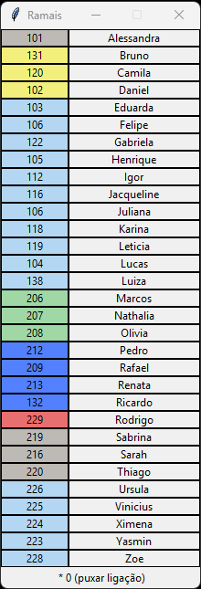

# Ramal List 📞



## Description 📝

This project compiles a list of phone extensions using PyInstaller. The resulting executable is packaged as a single file with a custom icon.

## Build Instructions 🛠️

To build the executable, use the following command:

```bash
pyinstaller --onefile --noconsole --name ramais --icon phone.ico main.py
```
